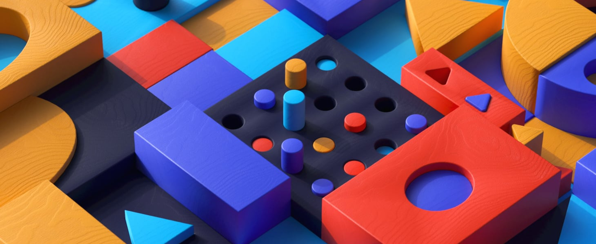

# Frontend Mentor - News homepage solution

This is a solution to the [News homepage challenge on Frontend Mentor](https://www.frontendmentor.io/challenges/news-homepage-H6SWTa1MFl). Frontend Mentor challenges help you improve your coding skills by building realistic projects.

## Table of contents

- [Overview](#overview)
  - [The challenge](#the-challenge)
  - [Screenshot](#screenshot)
  - [Links](#links)
- [My process](#my-process)
  - [Built with](#built-with)
- [Author](#author)

## Overview

### The challenge

Users should be able to:

- View the optimal layout for the interface depending on their device's screen size
- See hover and focus states for all interactive elements on the page

### Screenshot

### Links

- Solution URL: [https://github.com/jkaps9/news-homepage](https://github.com/jkaps9/news-homepage)
- Live Site URL: [https://jkaps9.github.io/news-homepage/](https://jkaps9.github.io/news-homepage/)

## My process

### Built with

- Semantic HTML5 markup
- CSS custom properties
- Flexbox
- Mobile-first workflow
- [Astro](https://astro.build/) - Static Site Generator
- [SASS](https://sass-lang.com) - CSS preprocessor

## Author

- Frontend Mentor - [@jkaps9](https://www.frontendmentor.io/profile/jkaps9)
